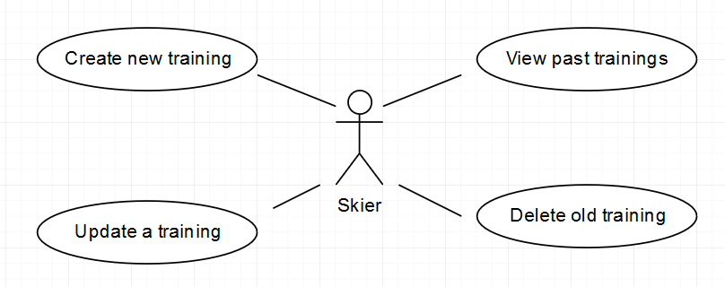
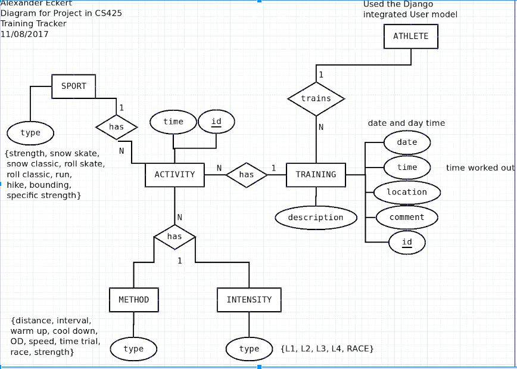
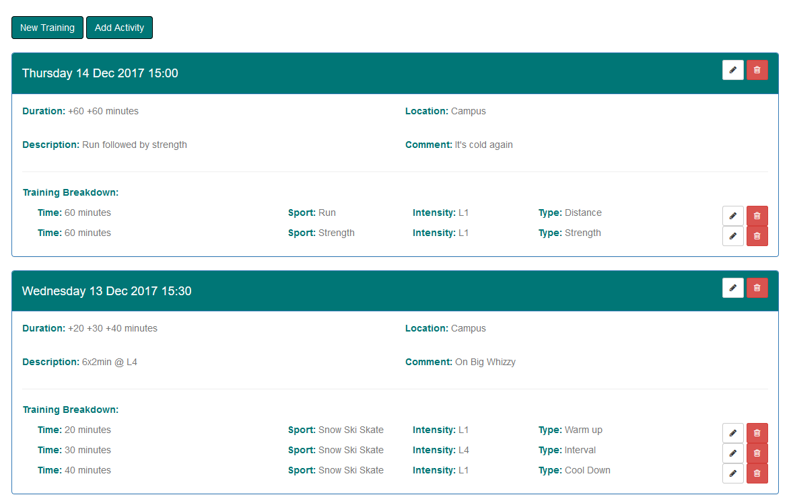
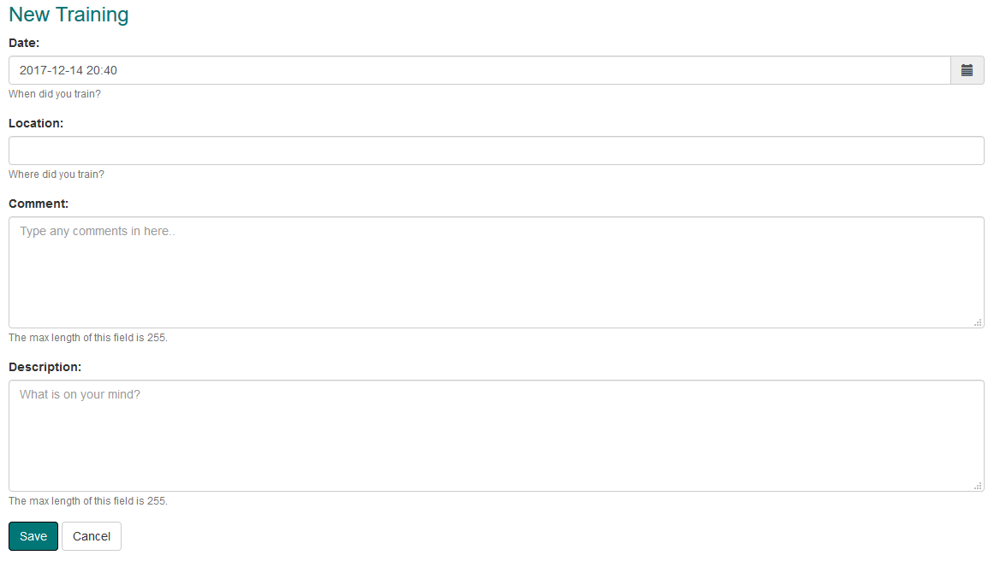
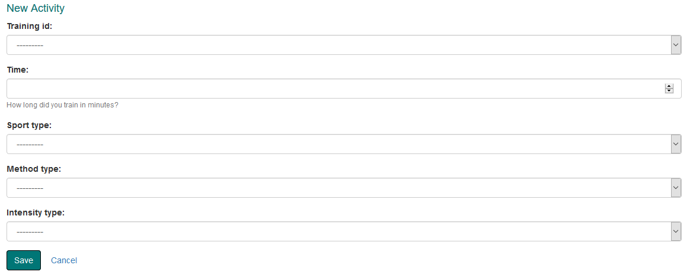
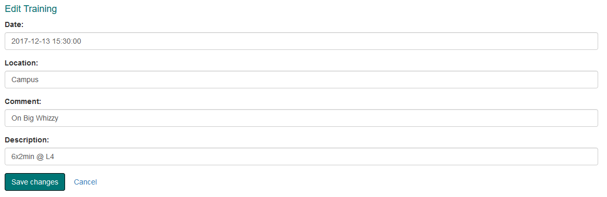
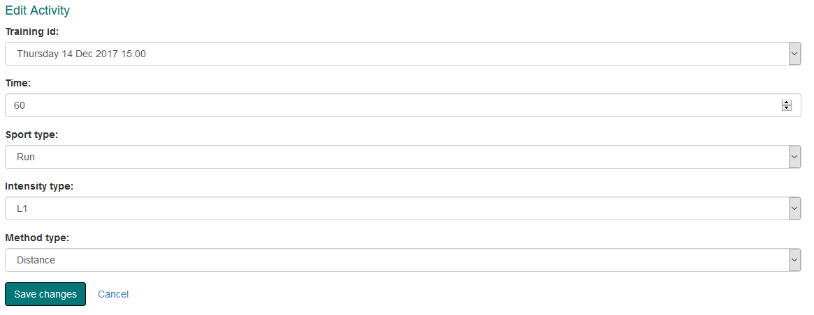

# Training Tracker
Web application written in Django using a MySQL database.

Targeted at cross country skiers to log their training, it supports registration, and allows the user to perform all CRUD operations on their entries.

## Purpose/Motivation

## Database Architecture Diagram

## Impressions

